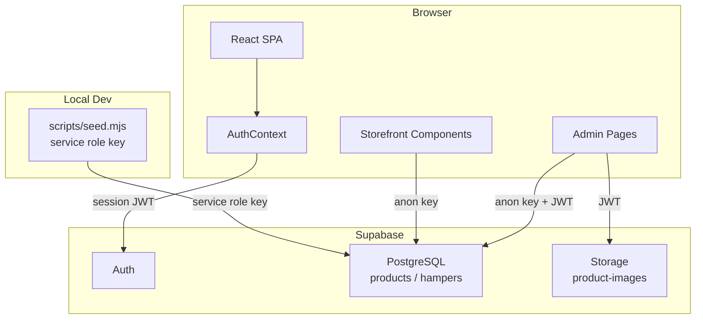

# Design Document: Admin Product Dashboard

## Overview

This feature introduces a protected admin dashboard for the Tiny Bitty website, enabling authorized admins to create, read, update, and delete products (cookies and juice) and hampers (seasonal gift sets). The dashboard replaces the current static data approach — `src/data/products.json` and the hardcoded `seasonalHampers` array in `HampersSection.tsx` — with a live Supabase PostgreSQL backend.

The work breaks into four distinct areas:

1. **Backend setup**: Supabase tables (`products`, `hampers`), RLS policies, and a Storage bucket (`product-images`).
2. **Auth layer**: Supabase Auth email/password login, an `AuthContext`, and an `AuthGuard` component protecting the `/admin` route.
3. **Admin UI**: New pages and forms under `/admin` for listing, creating, editing, and deleting products and hampers.
4. **Storefront wiring**: `ProductSection` and `HampersSection` updated to fetch from Supabase instead of static files, with the data-fetching logic moved inside those components.

A one-time Node.js migration script (`scripts/seed.mjs`) seeds the existing static data into Supabase using the service role key, run locally before go-live.

### Key Design Decisions

- **No backend API**: All Supabase operations go directly from the React client. Public reads use the anon key; writes use the authenticated user's JWT enforced by RLS.
- **Admin allowlist via RLS**: A hardcoded list of admin emails lives in a Supabase RLS policy function, avoiding the need for a separate `admins` table.
- **Image hosting**: Supabase Storage replaces Cloudinary. Admins upload directly from the browser; public URLs are stored in the database.
- **Storefront independence**: `ProductSection` and `HampersSection` fetch their own data on mount, making `home.tsx` free of any data-fetching logic for products and hampers.

---

## Architecture



### Request Flow (Write Operation)

1. Admin navigates to `/admin`. `AuthGuard` checks session from `AuthContext`.
2. If unauthenticated → redirect to `/admin/login`.
3. On login, `supabase.auth.signInWithPassword(...)` returns a session.
4. `AuthContext` checks that the user's email is on the allowlist embedded in the RLS policy. If not, access is denied.
5. Authenticated admin performs CRUD — the Supabase client sends the user JWT automatically on every request.
6. RLS policies on the database enforce that writes are only permitted for allowlisted emails.

### Request Flow (Public Read)

1. Storefront component mounts → calls `supabase.from('products').select(...)` with the anon key.
2. RLS allows SELECT for all users including unauthenticated → data returned directly.

---

## Components and Interfaces

### New File Structure

```
src/
  lib/
    supabase.ts                    ← singleton Supabase client
  contexts/
    AuthContext.tsx                ← session state + auth helpers
  components/
    admin/
      AuthGuard.tsx                ← route protection wrapper
      AdminLayout.tsx              ← shared nav/header for admin pages
      ImageUploader.tsx            ← file upload to Supabase Storage
      DeleteConfirmDialog.tsx      ← reusable confirmation dialog
      products/
        ProductList.tsx            ← grouped product listing
        ProductForm.tsx            ← create/edit product form
      hampers/
        HamperList.tsx             ← hamper listing
        HamperForm.tsx             ← create/edit hamper form
  pages/
    admin/
      AdminLoginPage.tsx           ← /admin/login
      AdminDashboardPage.tsx       ← /admin — product + hamper tabs
scripts/
  seed.mjs                         ← one-time data migration
```

### Component Interfaces

```typescript
// AuthContext
interface AuthContextValue {
  session: Session | null;
  isAdmin: boolean;
  isLoading: boolean;
  signIn: (email: string, password: string) => Promise<{ error: AuthError | null }>;
  signOut: () => Promise<void>;
}

// AuthGuard — wraps any route that needs admin access
interface AuthGuardProps {
  children: React.ReactNode;
}

// ImageUploader
interface ImageUploaderProps {
  value: string;           // current image URL
  onChange: (url: string) => void;
  bucket?: string;         // defaults to 'product-images'
  disabled?: boolean;
}

// ProductForm
interface ProductFormProps {
  product?: ProductRow;    // undefined = create mode, defined = edit mode
  onSuccess: () => void;
  onCancel: () => void;
}

// HamperForm
interface HamperFormProps {
  hamper?: HamperRow;
  onSuccess: () => void;
  onCancel: () => void;
}

// DeleteConfirmDialog
interface DeleteConfirmDialogProps {
  open: boolean;
  itemName: string;
  onConfirm: () => Promise<void>;
  onCancel: () => void;
}
```

### Updated Storefront Components

`ProductSection` will drop its `categories` prop and fetch data internally:

```typescript
// Before
interface ProductSectionProps {
  categories: Category[];
}

// After — no props needed; data is fetched internally
export default function ProductSection(): JSX.Element
```

`HampersSection` will replace the hardcoded `seasonalHampers` array with a `useEffect` fetch from Supabase.

`home.tsx` will be simplified — it will no longer import `products.json` or sort/prepare category data. It will simply render `<ProductSection />` and `<HampersSection />` with no props.

---

## Data Models

### Supabase: `products` Table

```sql
CREATE TABLE products (
  id           TEXT PRIMARY KEY,
  name         TEXT NOT NULL,
  description  TEXT NOT NULL DEFAULT '',
  category     TEXT NOT NULL CHECK (category IN ('cookies', 'juice')),
  image        TEXT NOT NULL DEFAULT '',
  variants     JSONB NOT NULL DEFAULT '[]',
  ingredients  JSONB NOT NULL DEFAULT '[]',
  toppings     JSONB NOT NULL DEFAULT '[]',
  is_new       BOOLEAN NOT NULL DEFAULT false,
  created_at   TIMESTAMPTZ NOT NULL DEFAULT NOW(),
  updated_at   TIMESTAMPTZ NOT NULL DEFAULT NOW()
);
```

`variants` column stores an array of `{ size: string, price: number }` objects.
`ingredients` and `toppings` store arrays of strings.

### Supabase: `hampers` Table

```sql
CREATE TABLE hampers (
  id               TEXT PRIMARY KEY,
  name             TEXT NOT NULL,
  description      TEXT NOT NULL DEFAULT '',
  image            TEXT NOT NULL DEFAULT '',
  images           JSONB NOT NULL DEFAULT '[]',
  price            INTEGER,                    -- NULL when multi-variant
  hamper_variants  JSONB NOT NULL DEFAULT '[]', -- [] when single-price
  rating           NUMERIC(3,1) NOT NULL DEFAULT 0.0,
  sales            TEXT NOT NULL DEFAULT '',
  seasonal         TEXT NOT NULL DEFAULT '',
  whats_included   JSONB NOT NULL DEFAULT '[]',
  created_at       TIMESTAMPTZ NOT NULL DEFAULT NOW(),
  updated_at       TIMESTAMPTZ NOT NULL DEFAULT NOW()
);
```

`hamper_variants` stores `{ name: string, price: number }[]` for multi-price hampers (e.g., eid-d). When a hamper uses a single price, `price` is set and `hamper_variants` is `[]`. When multi-variant, `price` is `NULL` and `hamper_variants` is populated. These are mutually exclusive.

### TypeScript Types (`src/types/supabase-models.ts`)

```typescript
export interface ProductVariantDB {
  size: string;
  price: number;
}

export interface ProductRow {
  id: string;
  name: string;
  description: string;
  category: 'cookies' | 'juice';
  image: string;
  variants: ProductVariantDB[];
  ingredients: string[];
  toppings: string[];
  is_new: boolean;
  created_at: string;
  updated_at: string;
}

export interface HamperVariantDB {
  name: string;
  price: number;
}

export interface HamperRow {
  id: string;
  name: string;
  description: string;
  image: string;
  images: string[];
  price: number | null;
  hamper_variants: HamperVariantDB[];
  rating: number;
  sales: string;
  seasonal: string;
  whats_included: string[];
  created_at: string;
  updated_at: string;
}
```

### RLS Policies

```sql
-- Products: public read, admin-only write
ALTER TABLE products ENABLE ROW LEVEL SECURITY;

CREATE POLICY "products_public_read" ON products
  FOR SELECT USING (true);

CREATE POLICY "products_admin_write" ON products
  FOR ALL
  USING (
    auth.email() IN (
      'admin@tinybitty.com'
      -- add more admin emails here
    )
  )
  WITH CHECK (
    auth.email() IN (
      'admin@tinybitty.com'
    )
  );

-- Hampers: same pattern
ALTER TABLE hampers ENABLE ROW LEVEL SECURITY;

CREATE POLICY "hampers_public_read" ON hampers
  FOR SELECT USING (true);

CREATE POLICY "hampers_admin_write" ON hampers
  FOR ALL
  USING (auth.email() IN ('admin@tinybitty.com'))
  WITH CHECK (auth.email() IN ('admin@tinybitty.com'));
```

### Storage Bucket Policy

```sql
-- product-images bucket: public read, authenticated write
CREATE POLICY "storage_public_read" ON storage.objects
  FOR SELECT USING (bucket_id = 'product-images');

CREATE POLICY "storage_admin_upload" ON storage.objects
  FOR INSERT
  WITH CHECK (
    bucket_id = 'product-images'
    AND auth.email() IN ('admin@tinybitty.com')
  );

CREATE POLICY "storage_admin_delete" ON storage.objects
  FOR DELETE
  USING (
    bucket_id = 'product-images'
    AND auth.email() IN ('admin@tinybitty.com')
  );
```

### Supabase Client Singleton (`src/lib/supabase.ts`)

```typescript
import { createClient } from '@supabase/supabase-js';

const supabaseUrl = import.meta.env.VITE_SUPABASE_URL as string;
const supabaseAnonKey = import.meta.env.VITE_SUPABASE_ANON_KEY as string;

export const supabase = createClient(supabaseUrl, supabaseAnonKey);
```

### Zod Validation Schemas

```typescript
// Product form schema
const productFormSchema = z.object({
  id: z.string().min(1),
  name: z.string().min(1, 'Name is required'),
  description: z.string().min(1, 'Description is required'),
  category: z.enum(['cookies', 'juice']),
  image: z.string().url('A valid image URL is required'),
  variants: z.array(
    z.object({
      size: z.string().min(1, 'Size is required'),
      price: z.number().int().min(1).max(100_000_000),
    })
  ).min(1, 'At least one variant is required'),
  ingredients: z.array(z.string().min(1)).default([]),
  toppings: z.array(z.string().min(1)).default([]),
  is_new: z.boolean().default(false),
});

// Hamper form schema
const hamperFormSchema = z.object({
  id: z.string().min(1),
  name: z.string().min(1, 'Name is required'),
  description: z.string().min(1, 'Description is required'),
  image: z.string().url('A valid primary image URL is required'),
  images: z.array(z.string().url()).max(10).default([]),
  pricing_mode: z.enum(['single', 'multi']),
  price: z.number().int().min(1).max(100_000_000).optional(),
  hamper_variants: z.array(
    z.object({
      name: z.string().min(1),
      price: z.number().int().min(1).max(100_000_000),
    })
  ).default([]),
  rating: z.number().min(0).max(5),
  sales: z.string().min(1, 'Sales label is required'),
  seasonal: z.string().min(1, 'Seasonal tag is required'),
  whats_included: z.array(z.string().min(1)).min(1, 'At least one item required'),
});
```

### Migration Script Shape (`scripts/seed.mjs`)

The script reads `src/data/products.json` and the `seasonalHampers` array (copied as a JS object), then calls `supabase.from('products').upsert(...)` and `supabase.from('hampers').upsert(...)` with `onConflict: 'id'`. The script uses the service role key via `SUPABASE_SERVICE_ROLE_KEY` environment variable (not prefixed with `VITE_`, so it is never bundled).

---

## Correctness Properties

*A property is a characteristic or behavior that should hold true across all valid executions of a system — essentially, a formal statement about what the system should do. Properties serve as the bridge between human-readable specifications and machine-verifiable correctness guarantees.*

### Property 1: Product form validation rejects invalid inputs

*For any* product form submission where a required field is missing, a price is outside the valid range (≤ 0 or > 100,000,000), or the variants array is empty, the form validation function SHALL return a non-empty errors object and SHALL NOT produce a valid parsed form value.

**Validates: Requirements 3.3, 3.7**

### Property 2: Hamper form validation rejects invalid inputs

*For any* hamper form submission where a required field is missing, the rating is outside 0–5, `whatsIncluded` is empty, or a price variant price is ≤ 0, the form validation function SHALL return a non-empty errors object and SHALL NOT produce a valid parsed form value.

**Validates: Requirements 7.1, 7.5, 7.8**

### Property 3: Pricing mode mutual exclusivity

*For any* hamper form value, if `pricing_mode` is `'single'`, then `hamper_variants` SHALL be an empty array; if `pricing_mode` is `'multi'`, then `price` SHALL be `undefined` or `null`. These two conditions SHALL never both be false simultaneously.

**Validates: Requirements 7.4**

### Property 4: Image file validation rejects disallowed types and oversized files

*For any* file object submitted to the `ImageUploader`, if the file's MIME type is not one of `image/jpeg`, `image/png`, `image/webp` OR the file size exceeds 5 MB (5,242,880 bytes), the validation function SHALL return a validation error string and SHALL NOT initiate a storage upload.

**Validates: Requirements 3.4, 10.1, 10.2**

### Property 5: Product serialization round-trip

*For any* valid `ProductRow` object read from the Supabase database, serializing it to the Zod form schema shape and back to a database row shape SHALL produce an object that deep-equals the original on all fields (`name`, `description`, `category`, `image`, `variants`, `ingredients`, `toppings`, `is_new`).

**Validates: Requirements 3.1, 4.2**

### Property 6: Hamper serialization round-trip

*For any* valid `HamperRow` object read from the Supabase database, serializing it to the Zod form schema shape and back to a database row shape SHALL produce an object that deep-equals the original on all fields (`name`, `description`, `image`, `images`, `price`, `hamper_variants`, `rating`, `sales`, `seasonal`, `whats_included`).

**Validates: Requirements 7.1, 8.2**

### Property 7: Admin allowlist check is consistent

*For any* user email string, the `isAdminEmail` helper function SHALL return the same boolean value regardless of how many times it is called with that input (pure, side-effect-free).

**Validates: Requirements 1.4, 13.1**

---

## Error Handling

### Authentication Errors

| Scenario | Handling |
|---|---|
| Invalid credentials | Display "Invalid email or password" message. No stack trace. |
| Non-admin email logs in | Show "Access denied" message, redirect to `/admin/login`. |
| Session check timeout (>5 s) | Treat as unauthenticated, redirect to `/admin/login`. |
| Expired session on write | Show "Session expired. Please log in again." Do not execute write. |

### Data Fetch Errors (Admin and Storefront)

| Scenario | Handling |
|---|---|
| Supabase query fails | Show error message + Retry button. No stale data rendered. |
| Empty result set | Show empty-state message (not a blank section). |
| While loading | Show loading skeleton or spinner. |

### Form / Image Errors

| Scenario | Handling |
|---|---|
| Required field missing | Inline error adjacent to the field. Form does not submit. |
| Image wrong type/size | Show specific error ("Must be JPEG, PNG, or WebP under 5 MB"). No upload initiated. |
| Upload fails after valid file | Show "Image upload failed." Retain existing image URL. Submit button re-enabled. |
| DB write fails (create/edit) | Show error message. All form field values retained. No data loss. |
| DB delete fails | Show error message. Record left intact in DB and UI. |

### Error Message Guidelines

- No raw error objects, no stack traces, no internal Supabase identifiers in user-facing messages.
- Error messages should be actionable — tell the user what to do next (retry, re-enter credentials, choose a smaller file).
- Transient success toasts auto-dismiss after 5 seconds. Error messages persist until the user dismisses or the condition resolves.

---

## Testing Strategy

### Unit Tests (Vitest)

Unit tests focus on pure logic that does not require a real browser or Supabase connection.

- **Form validation** (`productFormSchema`, `hamperFormSchema`): test valid inputs parse correctly; test each invalid input produces the right field error; test boundary values (price = 0, price = 100,000,001, rating = 5.0, rating = 5.1).
- **`isAdminEmail` helper**: test known admin email returns `true`; test unknown email returns `false`; test email with different casing.
- **`ImageUploader` validation logic**: test each allowed MIME type passes; test each disallowed MIME type fails; test file sizes at the 5 MB boundary.
- **Hamper pricing mode toggle**: test that switching from `single` to `multi` clears the `price` field; test that switching from `multi` to `single` clears `hamper_variants`.
- **Storefront data mapping functions** (DB row → component prop shape): test that all fields map correctly for both products and hampers.

### Property-Based Tests (fast-check)

Use [fast-check](https://fast-check.io/) (already compatible with Vitest). Each property test runs a minimum of 100 iterations.

**Feature: admin-product-dashboard, Property 1: Product form validation rejects invalid inputs**
Generate random product form objects with at least one invalid field (missing name, empty variants array, price of 0, price of 100,000,001). Assert `productFormSchema.safeParse(input).success === false` for all generated inputs.

**Feature: admin-product-dashboard, Property 2: Hamper form validation rejects invalid inputs**
Generate random hamper form objects with at least one invalid field. Assert `hamperFormSchema.safeParse(input).success === false`.

**Feature: admin-product-dashboard, Property 3: Pricing mode mutual exclusivity**
Generate random hamper form values with either `pricing_mode: 'single'` or `pricing_mode: 'multi'`. Assert the correct field is present/absent after normalization.

**Feature: admin-product-dashboard, Property 4: Image file validation rejects disallowed types and oversized files**
Generate random `{ type: string, size: number }` objects where type is not in the allowlist or size > 5 MB. Assert `validateImageFile(file).isValid === false`.

**Feature: admin-product-dashboard, Property 5: Product serialization round-trip**
Generate random `ProductRow` objects with valid field values. Serialize to form shape using `toProductFormValues(row)`, then back to DB shape using `toProductRow(formValues)`. Assert deep equality on all non-timestamp fields.

**Feature: admin-product-dashboard, Property 6: Hamper serialization round-trip**
Same pattern as Property 5 for `HamperRow`.

**Feature: admin-product-dashboard, Property 7: Admin allowlist check is consistent**
Generate random email strings. Assert `isAdminEmail(email) === isAdminEmail(email)` (idempotent for any input).

### Integration Tests

These use a real or mocked Supabase client and are run against a local Supabase instance or with msw stubs.

- Auth flow: sign in with valid admin credentials succeeds; non-admin email is denied.
- CRUD: create a product, read it back, update a field, delete it — assert the DB state matches expectations at each step.
- Storage: upload a valid image, assert a public URL is returned; attempt to upload without a valid session, assert rejection.
- RLS: attempt INSERT/UPDATE/DELETE with the anon key, assert it is rejected; with admin JWT, assert it succeeds.

### Test Configuration

```typescript
// vitest.config.ts (add to existing or create)
import { defineConfig } from 'vitest/config';

export default defineConfig({
  test: {
    globals: true,
    environment: 'jsdom',
  },
});
```

Property tests use fast-check with `fc.assert(fc.property(...), { numRuns: 100 })` as the minimum iteration count.
